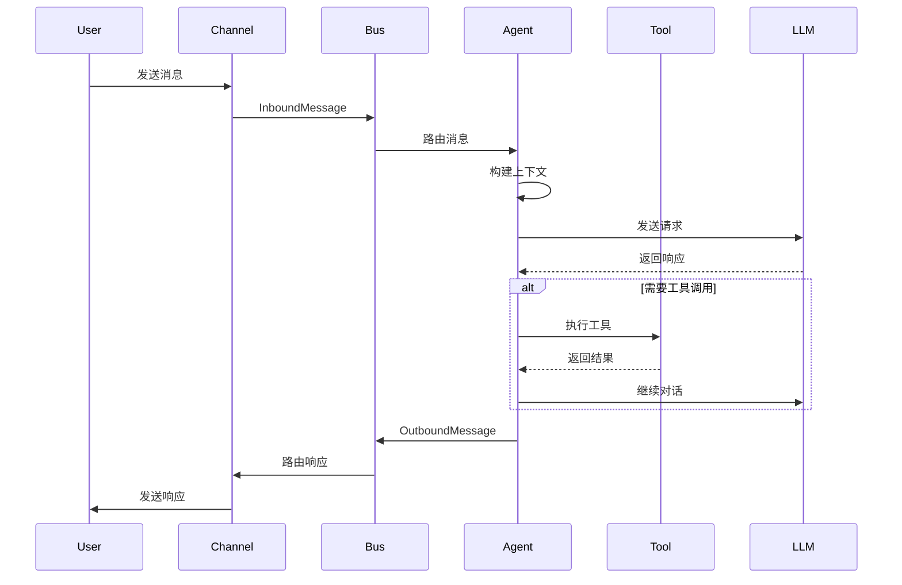

# AnyClaw 项目详细实现计划

## 文档信息

- **项目名称**: AnyClaw
- **创建日期**: 2026-03-17
- **版本**: v1.0.0
- **状态**: 规划中

---

## 目录

1. [项目概述](#1-项目概述)
2. [技术栈](#2-技术栈)
3. [架构设计](#3-架构设计)
4. [详细实现计划](#4-详细实现计划)
5. [开发阶段](#5-开发阶段)
6. [部署计划](#6-部署计划)
7. [测试策略](#7-测试策略)
8. [风险管理](#8-风险管理)
9. [参考资料](#9-参考资料)

---

## 1. 项目概述

### 1.1 项目背景

AnyClaw 是一个受 Nanobot 和 OpenClaw 启发的 AI 智能体项目，旨在打造一个轻量级、可扩展、多渠道的 AI 助手框架。

### 1.2 项目目标

| 目标维度 | 具体目标 |
|---------|---------|
| **核心目标** | 实现一个基于 Python 的轻量级 AI 智能体框架 |
| **功能目标** | 支持多渠道消息路由、技能扩展、工具调用、长期记忆 |
| **性能目标** | 支持并发处理，响应时间 < 2s |
| **扩展目标** | 插件化架构，支持第三方扩展 |
| **兼容目标** | 兼容主流 LLM 提供商（OpenAI、Claude、本地模型） |

### 1.3 项目范围

#### 包含功能
- ✅ 多渠道消息支持（Telegram、Discord、Slack、命令行）
- ✅ LLM 集成（多提供商支持）
- ✅ 技能系统（基于 Markdown 的技能定义）
- ✅ 工具调用系统（文件操作、Shell 命令、Web 搜索）
- ✅ 长期记忆管理
- ✅ 配置管理
- ✅ CLI 工具

#### 暂不包含
- ❌ 移动应用（iOS/Android）
- ❌ Web UI（第一版）
- ❌ 企业级功能（多租户、审计日志）
- ❌ 语音唤醒功能

---

## 2. 技术栈

### 2.1 编程语言

| 组件 | 语言 | 版本 | 说明 |
|-----|------|------|-----|
| **核心框架** | Python | 3.11+ | 主要开发语言，异步处理支持 |
| **CLI 工具** | Python | 3.11+ | 使用 Typer 框架 |
| **配置** | Python | 3.11+ | 使用 Pydantic 验证 |
| **扩展** | Python | 3.11+ | 技能和工具扩展 |

### 2.2 核心依赖

#### 2.2.1 框架和工具
```python
# 依赖管理
poetry>=1.8.0              # 依赖管理和打包

# 核心框架
typer>=0.20.0              # CLI 命令行框架
pydantic>=2.12.0           # 数据验证和序列化
pydantic-settings>=2.0.0   # 配置管理

# LLM 集成
litellm>=1.82.1            # LLM 统一接口
openai>=1.0.0              # OpenAI SDK
anthropic>=0.18.0          # Anthropic SDK

# 异步处理
asyncio>=3.11.0            # 异步 I/O（内置）
aiohttp>=3.9.0             # 异步 HTTP 客户端
websockets>=16.0           # WebSocket 支持
```

#### 2.2.2 消息处理
```python
# 消息队列
redis>=5.0.0               # 可选：Redis 作为消息队列
# 或使用内存队列（开发环境）

# 序列化
msgpack>=1.1.0             # 高效二进制序列化
orjson>=3.9.0              # 快速 JSON 处理
```

#### 2.2.3 频道集成
```python
# 核心频道
python-telegram-bot>=20.0  # Telegram Bot API
discord.py>=2.3.0          # Discord Bot API
slack-sdk>=3.27.0          # Slack SDK

# 可选频道
qq-botpy>=1.0.0            # QQ 机器人
dingtalk-stream>=1.0.0     # 钉钉集成
```

#### 2.2.4 工具和实用库
```python
# 文件操作
aiofiles>=23.0.0           # 异步文件操作
watchfiles>=0.21.0         # 文件监控

# Shell 执行
asyncssh>=2.14.0           # 异步 SSH

# Web 工具
httpx>=0.28.0              # 异步 HTTP 客户端
ddgs>=9.5.5                # DuckDuckGo 搜索
beautifulsoup4>=4.12.0     # HTML 解析

# 定时任务
croniter>=6.0.0            # Cron 表达式解析
apscheduler>=3.10.0        # 任务调度

# 终端美化
rich>=14.0.0               # 终端格式化
progress>=1.6              # 进度条

# 日志
loguru>=0.7.0              # 日志管理

# 测试
pytest>=8.0.0              # 测试框架
pytest-asyncio>=0.23.0     # 异步测试支持
pytest-cov>=4.1.0          # 覆盖率
```

### 2.3 开发工具

| 工具 | 用途 | 版本 |
|-----|------|-----|
| **Poetry** | 依赖管理和打包 | >=1.8.0 |
| **Black** | 代码格式化 | >=24.0.0 |
| **Ruff** | 代码检查 | >=0.3.0 |
| **MyPy** | 类型检查 | >=1.9.0 |
| **Pre-commit** | Git hooks | >=3.6.0 |

### 2.4 部署工具

| 工具 | 用途 | 版本 |
|-----|------|-----|
| **Docker** | 容器化 | >=24.0.0 |
| **Docker Compose** | 多容器编排 | >=2.20.0 |
| **GitHub Actions** | CI/CD | - |

---

## 3. 架构设计

### 3.1 整体架构

```
┌─────────────────────────────────────────────────────────────┐
│                        AnyClaw 系统                          │
├─────────────────────────────────────────────────────────────┤
│  ┌──────────────┐  ┌──────────────┐  ┌──────────────┐      │
│  │   CLI 层      │  │   Gateway    │  │   Web UI     │      │
│  └──────────────┘  └──────────────┘  └──────────────┘      │
├─────────────────────────────────────────────────────────────┤
│  ┌─────────────────────────────────────────────────────┐    │
│  │              消息总线 (Message Bus)                  │    │
│  └─────────────────────────────────────────────────────┘    │
├─────────────────────────────────────────────────────────────┤
│  ┌──────────┐ ┌──────────┐ ┌──────────┐ ┌──────────┐      │
│  │ Channels │ │  Agents  │ │  Skills  │ │  Tools   │      │
│  └──────────┘ └──────────┘ └──────────┘ └──────────┘      │
├─────────────────────────────────────────────────────────────┤
│  ┌──────────┐ ┌──────────┐ ┌──────────┐ ┌──────────┐      │
│  │  Config  │ │  Memory  │ │ Session  │ │ Provider │      │
│  └──────────┘ └──────────┘ └──────────┘ └──────────┘      │
└─────────────────────────────────────────────────────────────┘
```

### 3.2 核心模块

#### 3.2.1 Agent 系统
```python
# 核心组件
anyclaw/
├── agent/
│   ├── __init__.py
│   ├── loop.py              # 主处理循环
│   ├── context.py           # 上下文构建器
│   ├── memory.py            # 记忆管理
│   ├── skills.py            # 技能加载器
│   └── tools/               # 工具系统
│       ├── __init__.py
│       ├── base.py          # 工具基类
│       ├── registry.py      # 工具注册表
│       ├── filesystem.py    # 文件操作
│       ├── shell.py         # Shell 命令
│       ├── web.py           # Web 工具
│       └── cron.py          # 定时任务
```

#### 3.2.2 Channel 系统
```python
anyclaw/
├── channels/
│   ├── __init__.py
│   ├── base.py              # 频道基类
│   ├── manager.py           # 频道管理器
│   ├── telegram.py          # Telegram 频道
│   ├── discord.py           # Discord 频道
│   ├── slack.py             # Slack 频道
│   └── cli.py               # 命令行频道
```

#### 3.2.3 技能系统
```python
anyclaw/
├── skills/
│   ├── __init__.py
│   ├── loader.py            # 技能加载器
│   ├── executor.py          # 技能执行器
│   └── builtin/             # 内置技能
│       ├── summarize/
│       │   └── SKILL.md
│       ├── weather/
│       │   └── SKILL.md
│       └── memory/
│           └── SKILL.md
```

#### 3.2.4 配置系统
```python
anyclaw/
├── config/
│   ├── __init__.py
│   ├── settings.py          # 配置定义
│   ├── providers.py         # LLM 提供商配置
│   └── channels.py          # 频道配置
```

#### 3.2.5 消息总线
```python
anyclaw/
├── bus/
│   ├── __init__.py
│   ├── events.py            # 事件定义
│   ├── queue.py             # 消息队列
│   └── router.py            # 消息路由
```

### 3.3 数据流



---

## 4. 详细实现计划

### 4.1 第一阶段：基础设施（Week 1-2）

#### 4.1.1 项目初始化
- [ ] 创建项目结构
- [ ] 配置 Poetry 依赖管理
- [ ] 设置开发工具（Black、Ruff、MyPy）
- [ ] 配置 Pre-commit hooks
- [ ] 创建 README.md

#### 4.1.2 配置系统
- [ ] 实现 Pydantic Settings
- [ ] 支持环境变量配置
- [ ] 支持配置文件（YAML/TOML）
- [ ] LLM 提供商自动检测
- [ ] 频道配置管理

#### 4.1.3 日志和错误处理
- [ ] 集成 Loguru
- [ ] 定义日志级别和格式
- [ ] 实现全局异常处理
- [ ] 错误恢复机制

### 4.2 第二阶段：核心功能（Week 3-5）

#### 4.2.1 Agent 引擎
- [ ] 实现 AgentLoop 主循环
- [ ] 上下文构建器
- [ ] LLM 提供商集成
- [ ] 对话历史管理
- [ ] 并发任务处理

#### 4.2.2 工具系统
- [ ] 工具基类和注册表
- [ ] 文件系统工具
- [ ] Shell 命令工具
- [ ] Web 搜索工具
- [ ] 工具执行安全限制

#### 4.2.3 消息总线
- [ ] 事件定义
- [ ] 消息队列实现
- [ ] 消息路由器
- [ ] 异步处理

### 4.3 第三阶段：频道集成（Week 6-8）

#### 4.3.1 基础频道
- [ ] CLI 频道
- [ ] Telegram Bot 集成
- [ ] Discord Bot 集成
- [ ] Slack Bot 集成

#### 4.3.2 频道管理
- [ ] 频道注册和发现
- [ ] 消息格式转换
- [ ] 媒体文件处理
- [ ] 权限控制

### 4.4 第四阶段：高级功能（Week 9-11）

#### 4.4.1 技能系统
- [ ] 技能加载器
- [ ] 技能执行器
- [ ] 内置技能实现
- [ ] 技能依赖管理

#### 4.4.2 记忆系统
- [ ] 长期记忆存储
- [ ] 对话历史管理
- [ ] 记忆检索和更新
- [ ] 记忆持久化

#### 4.4.3 定时任务
- [ ] Cron 表达式解析
- [ ] 任务调度器
- [ ] 定时技能执行
- [ ] 任务管理 API

### 4.5 第五阶段：CLI 和工具（Week 12-13）

#### 4.5.1 命令行工具
- [ ] 主 CLI 入口
- [ ] 配置管理命令
- [ ] 技能管理命令
- [ ] 调试和监控命令

#### 4.5.2 开发工具
- [ ] 项目生成器
- [ ] 技能脚手架
- [ ] 测试工具
- [ ] 文档生成

### 4.6 第六阶段：测试和文档（Week 14-15）

#### 4.6.1 测试
- [ ] 单元测试覆盖（>80%）
- [ ] 集成测试
- [ ] 端到端测试
- [ ] 性能测试

#### 4.6.2 文档
- [ ] API 文档
- [ ] 用户手册
- [ ] 开发者指南
- [ ] 示例和教程

---

## 5. 开发阶段

### 5.1 Milestone 1：MVP（最小可行产品）
**目标日期**: Week 8

**交付物**:
- ✅ 基础 Agent 引擎
- ✅ LLM 集成（OpenAI）
- ✅ CLI 频道
- ✅ 基础工具（文件、Shell）
- ✅ 配置管理

### 5.2 Milestone 2：Beta 版本
**目标日期**: Week 12

**交付物**:
- ✅ 多频道支持（Telegram、Discord、Slack）
- ✅ 技能系统
- ✅ 记忆系统
- ✅ 定时任务
- ✅ 完整 CLI 工具

### 5.3 Milestone 3：正式版本 v1.0
**目标日期**: Week 15

**交付物**:
- ✅ 完整功能实现
- ✅ 测试覆盖率 >80%
- ✅ 完整文档
- ✅ Docker 部署
- ✅ 性能优化

---

## 6. 部署计划

### 6.1 开发环境

```bash
# 使用 Poetry 管理依赖
poetry install

# 启动开发服务器
poetry run anyclaw dev
```

### 6.2 生产环境

#### Docker 部署
```dockerfile
FROM python:3.11-slim

# 安装 Poetry
RUN pip install poetry

# 复制项目文件
COPY . /app
WORKDIR /app

# 安装依赖
RUN poetry install --only=main

# 启动服务
CMD ["poetry", "run", "anyclaw", "start"]
```

#### Docker Compose
```yaml
version: '3.8'
services:
  anyclaw:
    build: .
    environment:
      - OPENAI_API_KEY=${OPENAI_API_KEY}
      - TELEGRAM_BOT_TOKEN=${TELEGRAM_BOT_TOKEN}
    volumes:
      - ./workspace:/app/workspace
      - ./config:/app/config
```

### 6.3 云部署选项

| 平台 | 支持程度 | 说明 |
|-----|---------|-----|
| **Railway** | ✅ 推荐 | 简单易用，支持 Docker |
| **Render** | ✅ 推荐 | 免费层可用 |
| **Fly.io** | ✅ 推荐 | 全球部署 |
| **AWS ECS** | ✅ 企业级 | 适合大规模部署 |
| **DigitalOcean** | ✅ 稳定 | App Platform 支持 |

---

## 7. 测试策略

### 7.1 测试金字塔

```
        /\
       /  \      E2E Tests (10%)
      /____\
     /      \   Integration Tests (20%)
    /________\
   /          \ Unit Tests (70%~
  /______________\
```

### 7.2 测试覆盖率目标

| 模块 | 覆盖率目标 |
|-----|-----------|
| **Agent 核心** | >90% |
| **工具系统** | >85% |
| **频道系统** | >80% |
| **配置系统** | >90% |
| **整体** | >80% |

### 7.3 测试工具

- **pytest**: 测试框架
- **pytest-asyncio**: 异步测试
- **pytest-cov**: 覆盖率报告
- **pytest-mock**: Mock 工具

---

## 8. 风险管理

### 8.1 技术风险

| 风险 | 影响 | 缓解措施 |
|-----|------|---------|
| **LLM API 不稳定** | 高 | 实现重试机制、多提供商支持 |
| **异步处理复杂性** | 中 | 使用成熟的异步框架、充分测试 |
| **第三方 API 变更** | 中 | 版本锁定、适配器模式 |
| **性能问题** | 中 | 性能测试、缓存、优化 |

### 8.2 开发风险

| 风险 | 影响 | 缓解措施 |
|-----|------|---------|
| **功能蔓延** | 高 | 严格控制范围、MVP 优先 |
| **技术债务** | 中 | 代码审查、重构时间 |
| **文档滞后** | 低 | 同步编写文档 |
| **测试不足** | 中 | TDD 方法、CI 强制 |

---

## 9. 参考资料

### 9.1 参考项目

| 项目 | URL | 说明 |
|-----|-----|------|
| **Nanobot** | https://github.com/yourusername/nanobot | 主要参考项目 |
| **OpenClaw** | https://github.com/auenger/openclaw | 架构参考 |
| **LiteLLM** | https://github.com/BerriAI/litellm | LLM 统一接口 |

### 9.2 技术文档

| 文档 | URL |
|-----|-----|
| **Pydantic** | https://docs.pydantic.dev/ |
| **Typer** | https://typer.tiangolo.com/ |
| **AsyncIO** | https://docs.python.org/3/library/asyncio.html |
| **LiteLLM** | https://docs.litellm.ai/ |

### 9.3 最佳实践

- [Python AsyncIO 最佳实践](https://docs.python.org/3/library/asyncio.html)
- [Clean Code Python](https://github.com/zedr/clean-code-python)
- [The Hitchhiker's Guide to Python](https://docs.python-guide.org/)

---

## 附录

### A. 项目目录结构

```
anyclaw/
├── anyclaw/                   # 主包
│   ├── __init__.py
│   ├── agent/                 # Agent 系统
│   ├── channels/              # 频道系统
│   ├── skills/                # 技能系统
│   ├── tools/                 # 工具系统
│   ├── config/                # 配置系统
│   ├── bus/                   # 消息总线
│   ├── providers/             # LLM 提供商
│   ├── session/               # 会话管理
│   └── cli/                   # CLI 工具
├── tests/                     # 测试
│   ├── unit/
│   ├── integration/
│   └── e2e/
├── docs/                      # 文档
├── examples/                  # 示例
├── scripts/                   # 脚本
├── pyproject.toml             # 项目配置
├── README.md                  # 项目说明
├── LICENSE                    # 许可证
└── .github/                   # GitHub 配置
    └── workflows/
        └── ci.yml             # CI 配置
```

### B. 快速开始

```bash
# 克隆项目
git clone https://github.com/yourusername/anyclaw.git
cd anyclaw

# 安装依赖
poetry install

# 配置环境变量
cp .env.example .env
# 编辑 .env 文件

# 运行
poetry run anyclaw
```

### C. 环境变量

```bash
# LLM 配置
OPENAI_API_KEY=sk-xxx
ANTHROPIC_API_KEY=sk-ant-xxx

# 频道配置
TELEGRAM_BOT_TOKEN=xxx
DISCORD_BOT_TOKEN=xxx
SLACK_BOT_TOKEN=xxx

# 系统配置
LOG_LEVEL=INFO
WORKSPACE_DIR=./workspace
```

---

**文档版本**: v1.0.0
**最后更新**: 2026-03-17
**维护者**: AnyClaw Team
